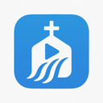

# wtrfll

LAN-friendly controller + display app for projecting scripture and lyrics in gatherings. Designed to be fast for volunteers and work well on local networks.

## What you can do (user-facing)
- Create or join a named session with a short code; controller/display links are auto-generated.
- Control view:
  - Add slides (scripture, lyrics; media placeholders ready).
  - Type a reference; we normalize it, fetch verses (RVR1960, NTV offline), and broadcast via realtime.
  - Choose translation with offline badges; send display commands (normal, black, clear, freeze).
  - Edit lyrics (ChordPro-style text), search saved songs, and publish to the display.
- Display view:
  - Join via link/token; projector-friendly layout; wake-lock to keep screens awake; minimal chrome.
- PWA ready: service worker + manifest for quick reloads/offline translations.

## Getting started (quick)
1) Backend: `dotnet run --project server/Wtrfll.Server.csproj`
2) Frontend: `npm install && npm run dev --prefix web`
3) Create a session at `http://localhost:5173/new`, open controller and display links, and start publishing.

## Technical details
- Backend: .NET 8 Minimal API + SignalR + SQLite; normalized translation providers.
- Frontend: Vue 3 + Vite + Pinia + Tailwind + Headless UI.
- Tests: xUnit + FluentAssertions; in-memory SQLite; real SignalR via TestServer. Run `dotnet test tests/server/Wtrfll.Server.Tests.csproj`.
- Documentation: see `docs/` for boundaries, architecture, UI flow, controller remodel plan, and test plan.
